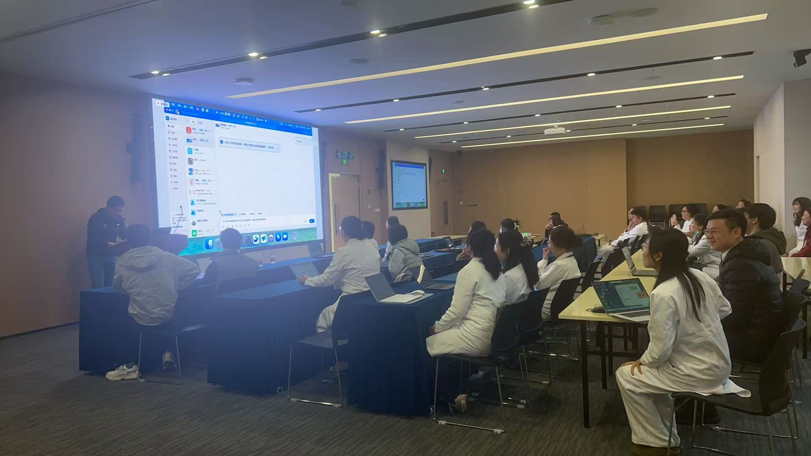
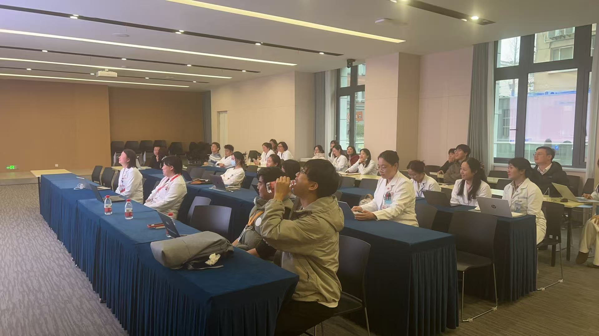
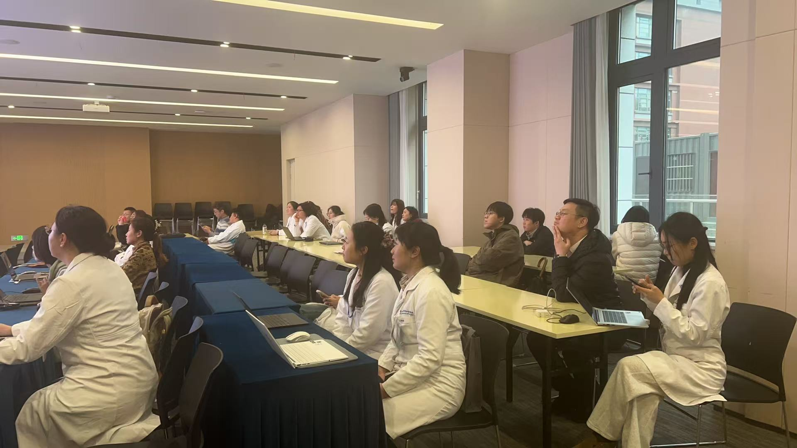
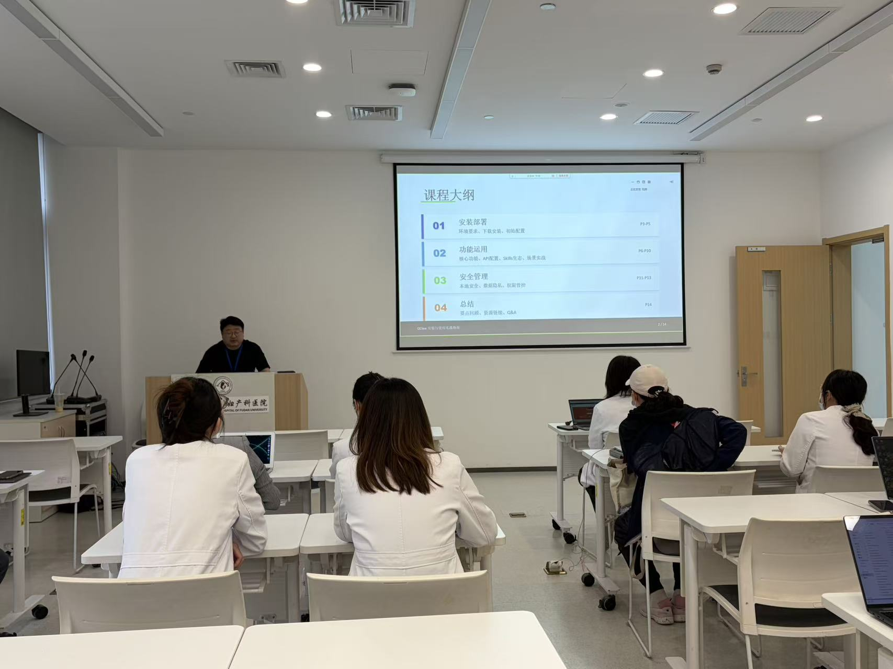
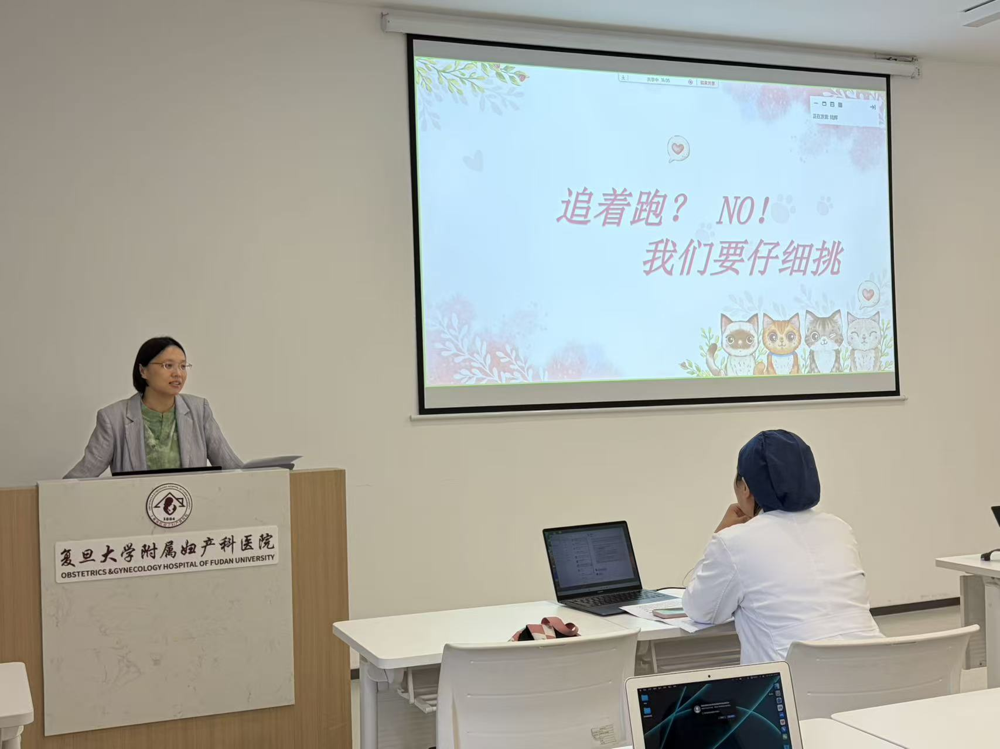
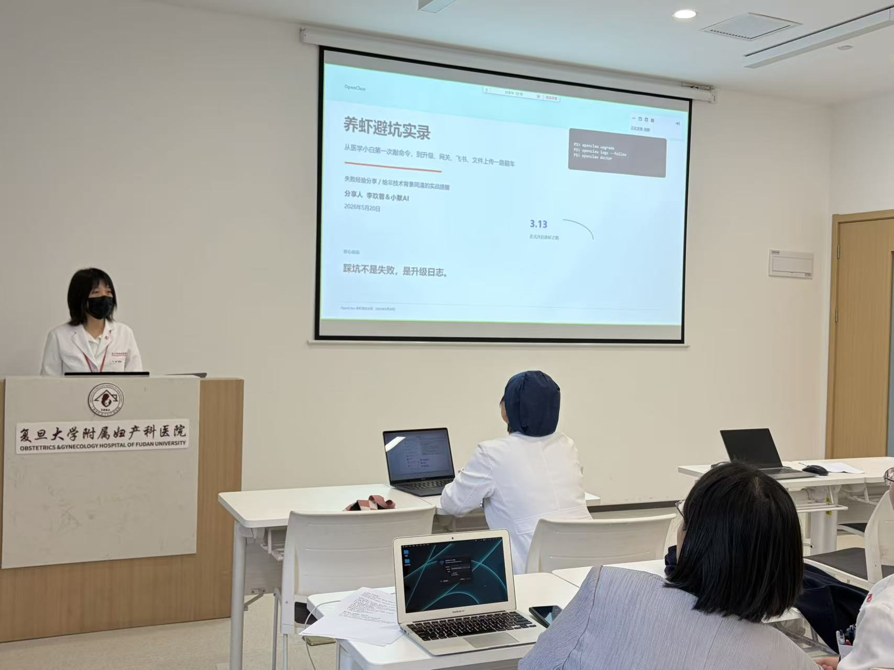
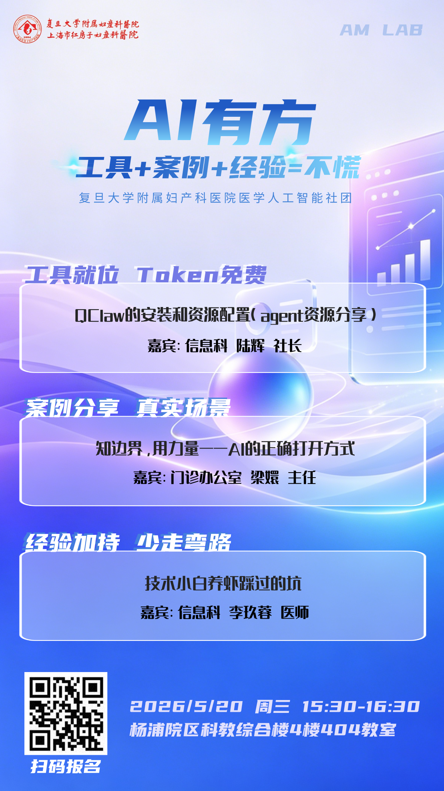

# 活动回顾

回顾 红房子AMlab社区 的精彩活动瞬间！

---

## 🎉 往期活动

### 📚 OpenClaw 安装教学（2026年3月）

**活动简介**：
- **时间**：2026年3月16日（周六）14:30-17:30
- **地点**：红房子AMlab 实验室
- **参与人数**：45 人
- **主讲人**：陆辉（社团社长）、微脉工程师

**活动内容**：
1. OpenClaw 是什么？能做什么？
2. Windows / macOS 安装步骤详解
3. 配置第一个 Agent（智能助手）
4. 常见问题与解决方案
5. 现场 Q&A

**活动照片**：

**回顾文章**：
（待添加活动总结链接）

**视频回放**：
（待添加 钉钉会议录制链接）

**PPT / 文档下载**：
- 02. 安装openclaw.docx（待上传）
- 03. 配置飞书聊天机器人.docx（待上传）
- 04. 购买大模型.docx（待上传）
- 05_-_GLM_Codingplan_配置.docx（待上传）
- 05_-_Minimax_Coding_Plan_配置.docx（待上传）

---

### 💬 经验分享会：养龙虾实践（2026年5月）

**活动简介**：
- **时间**：2026年5月20日（周日）15:30-17:00
- **地点**：线上（腾讯会议）
- **参与人数**：35 人
- **主讲人**：社区成员（陆辉、梁嬛、李玖蓉）

**活动内容**：
1. 陆辉：QClaw安装与使用实战指南
2. 梁嬛：AI的边界与能力
3. 李玖蓉：OpenClaw养虾避坑分享

**活动照片**：

**视频回放**：
（待添加腾讯会议录制链接）

**PPT 下载**：
- QClaw安装与使用实战指南-陆辉.pptx（待上传）
- AI的边界与能力--梁主任.pptx（待上传）
- OpenClaw养虾避坑分享--李玖蓉.pptx（待上传）

**优秀作品展示**：
- 陆辉的"每日提醒龙虾" — 查看配置（待添加）

---

## 📸 活动照片墙

（待嵌入图片轮播或照片墙插件）

*建议：使用 VitePress 的自定义组件，或者嵌入腾讯相册、Google Photos 分享链接*

---

## 💬 活动感想

欢迎在社区分享你的活动体验！

### 精选感想

（待添加社区成员的活动感想，可以是文字、视频、博客链接等）

**如何提交感想？**
1. 在 [GitHub 仓库](https://github.com/hyde1930/openclaw-guide) 提 Issue，标签选 `activity-review`
2. 或者发邮件到 luhui6556@fckyy.org.cn，标题写【活动感想】XXX
3. 优秀感想会展示在官网和社团公众号！

---

## 📊 活动档案

（按时间倒序排列）

| 活动名称 | 时间 | 参与人数 | 照片 | 视频 | 回顾文章 | PPT |
|---------|------|----------|------|------|-----------|-----|
| 经验分享会：养龙虾实践 | 2026-05-20 | 35 人 | 查看 | 观看 | 阅读 | 下载 |
| OpenClaw 安装教学 | 2026-03-16 | 45 人 | 查看 | 观看 | 阅读 | 下载 |

---

## 💡 想要组织活动？

欢迎联系我们，一起策划有趣的社区活动！

**联系方式**：
- 微信：AM_Lab红房子人工智能社团
- 邮箱：luhui6556@fckyy.org.cn
